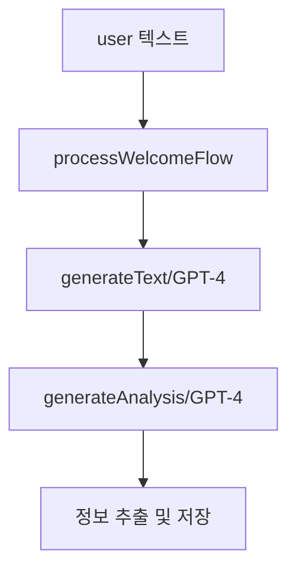
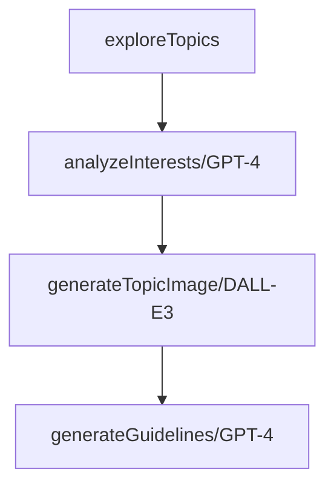
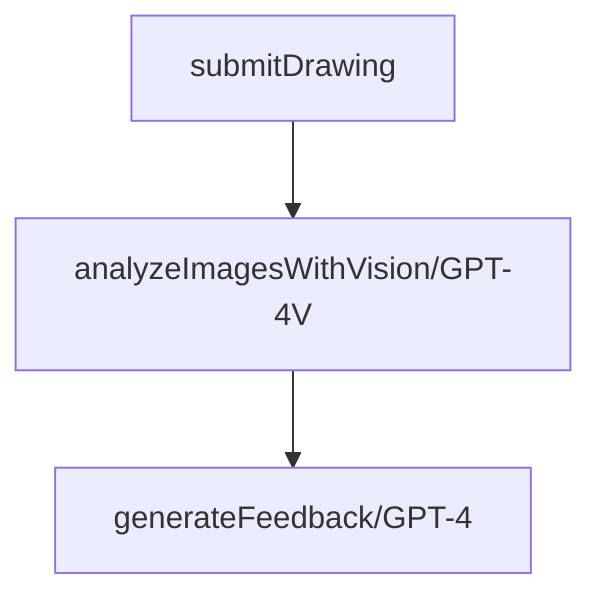

# 🎨 그림마당 AI 서버

## 📋 프로젝트 개요
노인 사용자를 위한 AI 기반 대화형 그림 그리기 서비스의 백엔드 서버입니다.

## 📋 목차
- [프로젝트 개요](#-프로젝트-개요)
- [최근 업데이트](#-최근-업데이트)
- [핵심 기능](#-핵심-기능)
- [AI 아키텍처](#-ai-아키텍처)
- [기술 스택](#-기술-스택)
- [API 엔드포인트](#-api-엔드포인트)
- [개발 환경 설정](#-개발-환경-설정)

## 🔄 최근 업데이트

### 1. 주제 추천 서비스 개선 (2025.01.10)
- **메타데이터 처리**
  - Spring 서버 연동
  - 조회-생성-저장 프로세스
  - API 최적화

- **응답 구조 개선**
  - 메타데이터 통합
  - 음성 응답 포함
  - 상태 정보 관리

### 2. 그림 평가 기능 (2025.01.11)
- **기능 개요**
  - AI 기반 그림 분석 및 점수 산정
  - 단계별 평가 (기본 형태 → 세부 묘사)
  - 음성 피드백 제공

- **평가 프로세스**
  - 1단계: 기본 형태 평가 (선, 모양, 비율)
  - 2단계: 세부 특징 평가 (색감, 질감, 디테일)

- **주요 기능**
  - GPT-4 Vision 기반 이미지 분석
  - 100점 만점 평가 (통과: 80점)
  - 음성 피드백 생성
  - 단계별 학습 지원

### 3. AWS S3 통합 (2025.01.11)
- **이미지 저장소 구현**
  - S3 업로드/다운로드 기능
  - URL-이미지 자동 처리
  - 보안 자격 증명 관리

- **DALL-E 연동 개선**
  - 생성 이미지 자동 저장
  - 영구 스토리지 활용
  - 안정적 이미지 제공

### 4. 음성 데이터 처리 개선 (2025.01.11)
- **데이터 최적화**
  - GZIP 압축 적용
  - base64 인코딩 제거
  - 바이너리 직접 전송

- **응답 포맷 개선**
  - MP3 형식 사용
  - 음성 속도 조절
  - 압축 버퍼 전송

### 5. 대화 내용 저장 로직 개선 (2025.01.11)
- **성능 최적화**
  - 불필요한 STT 변환 제거
  - 원본 텍스트 직접 저장
  - 메모리 사용량 감소

- **대화 정확도 향상**
  - AI 응답 텍스트 원본 보존
  - 변환 과정 최소화
  - 데이터 무결성 강화

- **코드 구조 개선**
  - 핸들러 함수 반환 타입 명확화
  - 응답 구조 일관성 유지
  - 에러 처리 강화

### 6. AI 응답 개선 (2025.01.11)
- **프롬프트 최적화**
  - 순수 JSON 응답 강화
  - 마크다운 사용 제한
  - 명확한 응답 형식 지정

- **에러 처리 강화**
  - JSON 파싱 오류 처리
  - 기본값 제공 로직
  - 상세 로깅 추가

- **성능 최적화**
  - 불필요한 API 호출 제거
  - TTS 임시 비활성화
  - 응답 처리 간소화

### 7. Node.js 경고 메시지 해결 (2025.01.11)
```powershell
# punycode 모듈 deprecation 경고 해결

# 1. 외부 punycode 패키지 설치
npm install punycode

# 2. 경고 무시하고 실행
node --no-deprecation your_script.js

# 3. 경고 발생 위치 추적
node --trace-deprecation your_script.js

# 4. 의존성 업데이트
npm update
```

### 8. 코드 최적화 및 성능 개선 (2025-01-12)
- TTS 기능 임시 비활성화 (비용 절감)
- 이미지 생성 기능 임시 비활성화 (비용 절감)
- 메시지 생성 로직 개선 및 단순화
  - `generateAIResponse` 함수를 `generateMessage`로 대체
  - 하드코딩된 메시지 사용으로 API 호출 최소화

### 9. 데이터 구조 개선 (2025-01-12)
- 대화 스키마 최적화
  - `aiResponse` 필드 제거
  - `originalText` 필드 추가로 텍스트 응답 저장 구조 개선
- 대화 순서 관리 기능 추가
  - `conversationOrder` 필드를 통한 대화 순서 추적
  - 세션별 대화 순서 자동 증가

### 10. 사용자 경험 개선 (2025-01-12)
- 주제 선택/확인 로직 개선
  - 선택 단계와 확인 단계 명확히 구분
  - 이전 대화 컨텍스트 활용 강화
- 오류 처리 강화
  - 메타데이터 처리 실패 시 기본값 제공
  - 환경 변수 누락 시 적절한 폴백 처리

### 11. 입력 처리 개선 (2025-01-12)
- 음성/텍스트 입력 처리 통합
  - Buffer 타입 지원 추가
  - 다양한 입력 형식 자동 감지 및 처리

### 12. 간단한 필드명 수정 (2025-01-13)
- Topics 서비스 개선
  - 주제 선택 및 확정 로직 개선
  - 대화 저장 시 필드명 수정 (originalText → aiResponse)
  - 로깅 추가로 디버깅 용이성 향상

### Google Speech API 설정
- 음성 인식을 위한 Google Cloud Speech-to-Text API 통합
- 설정 방법:
  1. Google Cloud Console에서 프로젝트 생성
  2. Speech-to-Text API 활성화
  3. API 키 생성
  4. `.env` 파일에 API 키 추가:
  ```env
  GOOGLE_API_KEY=your_google_api_key_here
  ```
- 임시 비활성화:
  - 테스트 시에는 `app.module.ts`에서 `GoogleModule` import를 주석 처리
  - 실제 운영 환경에서는 반드시 활성화 필요

## 🚀 핵심 기능

### 1. 대화 관리 (ConversationService)
- 음성-텍스트 변환 (STT)
- 자연어 처리 및 응답
- 텍스트-음성 변환 (TTS)
- 대화 이력 관리
- 개인화 대화
- 대화 컨텍스트 분석
  - 사용자 정보 추출 (관심사, 선호도)
  - 그리기 의도 파악
  - 대화 맥락 유지
- 세션 기반 대화 관리
  - 이전 대화 이력 추적
  - 대화 순서 자동 관리
  - 컨텍스트 기반 응답 생성

### 2. 사용자 데이터 관리 
- 기본 정보 관리
- 출석 데이터 추적
- 관심사 분석
- 상태 정보 저장
- 사용자 선호도 추적
  - 난이도 설정
  - 스타일 선호도
  - 주제 선호도
- 개인 상태 모니터링
  - 감정 상태 추적
  - 신체 상태 고려
  - 학습 경험 기록

### 3. 주제 추천 (TopicsService)
- 관심사 기반 추천
- 동적 주제 그룹
- 그리기 가이드라인
- DALL-E 이미지 생성
- 메타데이터 관리
- 주제 선택 프로세스
  - 첫 방문 처리
  - 주제 선택 단계
  - 주제 확정 단계
- 동적 주제 그룹 관리
  - 이전 추천 이력 추적
  - 중복 추천 방지
  - 난이도 기반 그룹화
- 가이드라인 생성
  - 단계별 학습 지침
  - 실패 시 기본 가이드라인 제공
  - JSON 형식 구조화

### 4. 그림 평가 (DrawingsService)
- AI 이미지 분석
- 단계별 평가
- 음성 피드백
- 학습 진행 관리
- 이미지 비교 분석
  - 형태/비율 평가 (40%)
  - 주요 특징 평가 (30%)
  - 선 품질 평가 (20%)
  - 색상 평가 (10%)
- 평가 결과 처리
  - 점수 산정 (100점 만점)
  - 맞춤형 피드백 생성
  - 재시도 로직 구현
- 오류 처리
  - 이미지 인식 실패 대응
  - 기본 피드백 제공
  - 평가 재시도 관리

### 5. 시스템 안정성
- 포트 관리
  - 자동 포트 탐색
  - 충돌 방지
  - 최대 10회 재시도
- 요청 처리 최적화
  - 50MB 요청 크기 제한
  - 음성/이미지 데이터 처리
  - CORS 설정
- 에러 처리 및 로깅
  - 상세 로그 기록
  - 에러 추적
  - 복구 메커니즘

## 🤖 AI 아키텍처

### AI 에이전트 구조

프로젝트는 4개의 주요 AI 에이전트로 구성되어 있으며, 각 에이전트는 특화된 역할을 수행한다:

#### 1. 대화 처리 에이전트 (ConversationService)
- 사용자와의 자연스러운 대화 처리
- 사용자 의도 및 정보 추출
- 대화 컨텍스트 관리


#### 2. 주제 추천 에이전트 (TopicsService)
- 사용자 맞춤형 그리기 주제 추천
- 예시 이미지 생성
- 단계별 가이드라인 제공


#### 3. 그림 평가 에이전트 (DrawingsService)
- 사용자 그림 분석 및 평가
- 맞춤형 피드백 생성
- 학습 진도 관리


### AI 모델 활용

| 모델 | 용도 | 특징 |
|------|------|------|
| GPT-4 | 대화/분석/가이드라인 | 컨텍스트 인식, 구조화된 출력 |
| GPT-4V | 이미지 분석/평가 | 이미지 이해, 비교 분석 |
| DALL-E 3 | 예시 이미지 생성 | 일관된 스타일, 학습 친화적 |
| Whisper-1 | 음성 인식 | 한국어 최적화 |
| TTS-1 | 음성 합성 | 자연스러운 발화 |

### 프롬프트 엔지니어링

각 에이전트는 최적화된 프롬프트 전략을 사용한다:

1. **대화 처리 프롬프트**
```typescript
"당신은 노인 사용자와 대화하는 AI 어시스턴트입니다.
- 20단어 이내 응답
- 이모지/이모티콘 사용 금지
- 한글과 기본 문장부호만 사용"
```

2. **주제 추천 프롬프트**
```typescript
"노인분들이 쉽게 그릴 수 있는 주제만 선택:
- 각 그룹당 3개의 단순한 주제
- 예시: 과일(사과,배,바나나)
- 복잡한 주제 제외"
```

3. **그림 평가 프롬프트**
```typescript
"노인 심리치료사 관점에서 평가:
1. 형태/비율 (40%)
2. 주요 특징 (30%)
3. 선 품질 (20%)
4. 색상 (10%)"
```

### 데이터 파이프라인

1. **대화 데이터**
   - MongoDB 저장
   - 세션별 컨텍스트 관리
   - 사용자 정보 구조화

2. **이미지 데이터**
   - S3 저장소 활용
   - 메타데이터 캐싱
   - 가이드라인 연동

3. **평가 데이터**
   - 단계별 진행 상황 추적
   - 피드백 이력 관리
   - 학습 패턴 분석

### 시스템 특징

1. **모듈화된 설계**
   - 독립적인 에이전트 구조
   - 유연한 확장성
   - 재사용 가능한 컴포넌트

2. **최적화된 성능**
   - 프롬프트 캐싱
   - 이미지 메타데이터 관리
   - 비동기 처리 최적화

3. **사용자 중심 설계**
   - 노인 친화적 인터페이스
   - 단계적 학습 구조
   - 맞춤형 피드백 시스템

## 🛠 기술 스택
- NestJS (Node.js)
- TypeScript 5.x
- MongoDB
- OpenAI API
  - GPT-3.5-turbo
  - GPT-4 Vision
  - Whisper
  - TTS
  - DALL-E
- Google Cloud Platform
  - Speech-to-Text API
  - Cloud Storage
- AWS S3
- Spring Boot 연동
- Swagger

## 📡 API 엔드포인트

### 1. 그림 평가
```http
POST /api/drawings/submit
```
- **요청**: sessionId, name, topic, phase, imageData
- **응답**: score, passed, aiFeedbackWav

### 2. 웰컴 플로우
```http
POST /api/conversation/welcomeFlow
```
- **요청**: sessionId, name, userRequestWelcomeWav, attendanceData
- **응답**: aiResponseWayWelcome, choice

### 3. 주제 추천
```http
POST /api/topics/explore
```
- **요청**: sessionId, name, userRequestExploreWav, metadata
- **응답**: topics, select, aiResponseExploreWav

## 💻 개발 환경 설정

### 1. 요구사항
```bash
Node.js >= 18.x
MongoDB >= 7.x
```

### 2. 필수 패키지
```bash
# 환경 변수 관리
npm install @nestjs/config

# OpenAI 파일 처리
npm install @web-std/file
```

### 3. 환경변수
```bash
# OpenAI API 설정
OPENAI_API_KEY=your_api_key

# MongoDB 설정
# 예시 입니다. 자신의 몽고DB 포트 확인해주세요.
MONGODB_URI=mongodb://localhost:27017/grimMadang

# Spring API 설정
# 예시 8080입니다. 자신의 스프링서버 포트 확인해주세요.
SPRING_API_URL=http://localhost:8080

# Google Cloud Speech-to-Text API 설정
GOOGLE_API_KEY=your_google_api_key

# AWS S3 설정
AWS_ACCESS_KEY=your_aws_key
AWS_SECRET_KEY=your_aws_secret
AWS_REGION=your_region
AWS_BUCKET_NAME=your_bucket_name
```

### 4. 설치 및 실행
```bash
# 설치
npm install

# 개발 실행
npm run start:dev

# 배포 실행
npm run start:prod
```

### 5. Node.js 경고 메시지 해결
```powershell
# punycode 모듈 deprecation 경고 해결

# 1. 외부 punycode 패키지 설치
npm install punycode

# 2. 경고 무시하고 실행
node --no-deprecation your_script.js

# 3. 경고 발생 위치 추적
node --trace-deprecation your_script.js

# 4. 의존성 업데이트
npm update
```

### 6. 문제 해결
```powershell
# 의존성 문제 발생시 아래 순서대로 실행

# 1. 현재 node_modules 삭제
Remove-Item -Recurse -Force node_modules

# 2. package-lock.json 삭제
Remove-Item package-lock.json

# 3. npm 캐시 정리
npm cache clean --force

# 4. 의존성 재설치
npm install
```

## 📚 API 문서
- Swagger UI: `http://localhost:3000/api-docs`
- 표준 응답 형식:
```json
{
  "statusCode": 200,
  "message": "Success",
  "data": {},
  "timestamp": "2025-01-11T00:00:00.000Z"
}
```